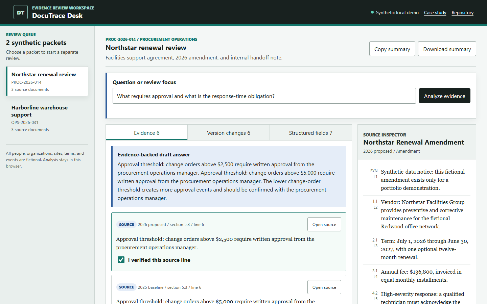
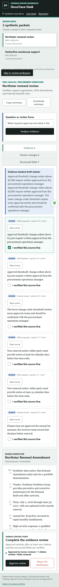

# DocuTrace Desk

DocuTrace Desk is a local-first document intelligence workspace for procurement and operations reviewers. It turns a fictional agreement packet into cited evidence, structured fields, version changes, risk flags, and an auditable human decision.

[Live demo](https://jubjub-cpu.github.io/doctrace-desk/) | [Case study](docs/CASE_STUDY.md) | [Architecture](docs/ARCHITECTURE.md) | [Release notes](docs/RELEASE_NOTES.md)

## Business Problem

Reviewers often compare agreements, amendments, and handoff notes manually. When findings are copied into a summary, the exact source line can disappear. DocuTrace keeps each answer attached to its fictional source and requires a person to verify evidence before approval.

## Target User

A procurement operations reviewer checking a vendor packet before an internal renewal or exception decision.

## Complete Workflow

1. Choose one of two synthetic review packets.
2. Ask a focused question about approval, response time, fees, notice, term, or data scope.
3. Review the deterministic answer and exact cited lines.
4. Open the source document and verify relevant citations.
5. Compare the baseline and proposed version clause by clause.
6. Check extracted fields against their source sections.
7. Approve the review or return it for clarification.
8. Copy or download a plain-text review summary.

The approval control stays locked until at least one citation and the structured fields have been verified.

## AI Role

The free demo uses transparent deterministic browser logic to simulate several document-intelligence patterns:

- Query expansion and relevance-ranked retrieval
- Line-level cited question answering
- Structured field extraction
- Clause-level version comparison
- Risk checklist generation
- Review-summary assembly

No live model is running, and mock output is never represented as a live AI response. A future bring-your-own-key adapter could replace individual analysis modules without changing the human-review workflow.

## Human Oversight

DocuTrace does not approve contracts, certify compliance, or provide legal advice. Every cited finding starts unverified. A reviewer checks the source, verifies the structured fields, and owns the final approve or return decision.

## Synthetic Data and Privacy

All organizations, sites, people, terms, and events are fictional. The app contains no customer records, contracts, private communications, credentials, payment data, medical data, or production logs. Processing stays in the browser and no document content is transmitted.

## Features

- Two fictional packets with three source documents each
- Loading, error, validation, no-result, pending, approved, and returned states
- Source inspector with line and section references
- Citation-level verification
- Responsive desktop and mobile layouts
- Keyboard-visible focus and semantic controls
- Downloadable local review summary
- No dependencies, sign-in, backend, or paid API

## Screenshots

Desktop evidence review at 1440px:



Mobile evidence review at 390px:



## Local Setup

Node.js is used only for the small local server and tests. There are no packages to install.

```powershell
Set-Location 'C:\Users\gabeb\Downloads\doctrace-desk'
node .\tools\static-server.mjs --port 4177
```

Open `http://127.0.0.1:4177/`.

Directly opening `index.html` may show the intentional data-loading error because some browsers block local JSON requests. The local server or live GitHub Pages deployment provides the complete workflow.

## Testing

Logic tests:

```powershell
node .\tests\analysis.test.mjs
```

Full repository validation:

```powershell
powershell -ExecutionPolicy Bypass -File .\tests\validate.ps1 -NodePath (Get-Command node).Source
```

Optional browser workflow suite after Playwright and Chromium are available:

```powershell
$env:PLAYWRIGHT_MODULE = (Resolve-Path .\node_modules\playwright\index.mjs)
node .\tests\browser-smoke.mjs
```

Run the same checks against the deployed release:

```powershell
$env:DOCUTRACE_BASE_URL = 'https://jubjub-cpu.github.io/doctrace-desk/'
node .\tests\browser-smoke.mjs
```

The validation checks required files, JSON fixtures, synthetic-data notices, disclosures, accessible HTML hooks, private-information patterns, common secret patterns, retrieval, extraction, version comparison, risk flags, and exported evidence. The optional browser suite covers both packets, keyboard entry, download, error states, desktop and mobile approval, and responsive overflow.

See [validation evidence](docs/VALIDATION.md) for the exact release checks and results.

## Architecture

```text
index.html
assets/
  app.js              browser state and interaction
  analysis.mjs        testable retrieval and review logic
  styles.css          responsive document-workspace design
data/
  packets.json        synthetic document fixtures
docs/
  ARCHITECTURE.md
  CASE_STUDY.md
  RELEASE_NOTES.md
  VALIDATION.md
  screenshots/
tests/
  analysis.test.mjs
  validate.ps1
tools/
  static-server.mjs
  static-server.ps1
```

The browser fetches the local JSON fixture, then runs all analysis locally. `analysis.mjs` contains pure functions that are shared by the product and Node.js tests. `app.js` owns review state, human verification, export, and UI rendering.

## Accessibility

- Skip link and semantic landmarks
- Visible keyboard focus
- Native buttons, search input, tabs, and checkboxes
- Live loading and validation status
- No color-only decision state
- Reduced-motion support
- Responsive layouts tested at 1440px and 390px

## Security

- No backend or external data transmission
- Static synthetic fixture only
- User query text is escaped before rendering
- No credentials required
- Secret and personal-information patterns checked before release
- Export remains a local browser download

## Deployment

The repository is designed for GitHub Pages from the `main` branch root. No build step is required.

GitHub Actions is optional. The current publishing token does not include the additional workflow scope, so the release uses the checked-in validation script and recorded local browser evidence instead.

## Known Limitations

- Retrieval is lexical with a small transparent synonym map, not embedding-based semantic search.
- Only the included JSON fixture is supported in v1.0.0.
- Version comparison relies on matching synthetic clause identifiers.
- Review identity is not authenticated or persisted.
- The product is a portfolio demonstration, not a legal or procurement system of record.

## Future Improvements

- Local PDF and text import
- Embedding-based retrieval that still exposes evidence
- Configurable extraction schemas and review rubrics
- Optional bring-your-own-key model adapter
- Signed reviewer identity and persistent audit storage

## AI-Assisted Development Disclosure

This portfolio project was built with AI-assisted development. Gabe directed the business problem, workflow, review controls, product scope, testing, validation, and visual refinement while using AI coding tools for implementation support. The repository does not claim production customer use, measured savings, or live autonomous AI.

## License

MIT. See [LICENSE](LICENSE).
